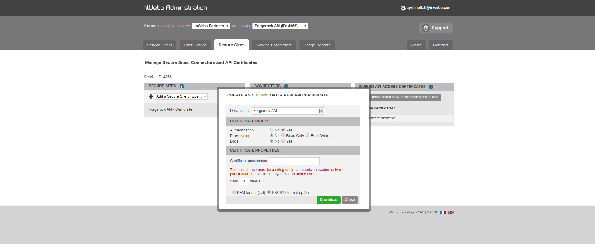
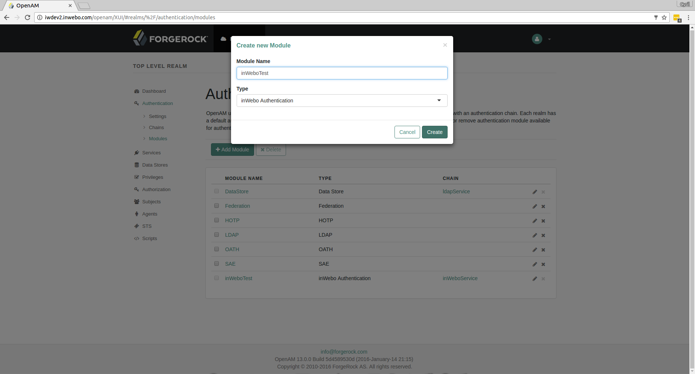
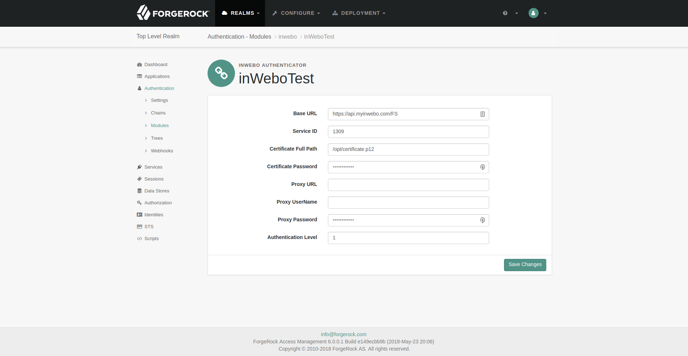
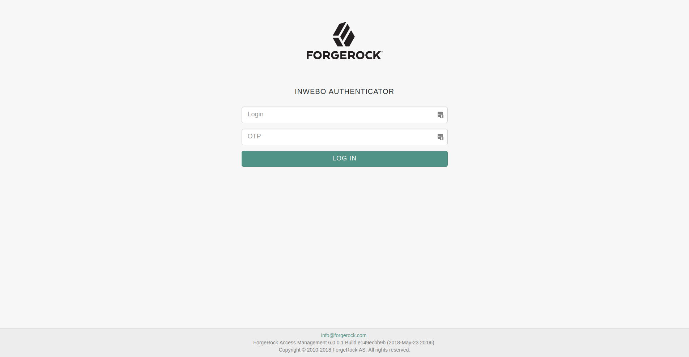

 inWebo ForgeRock AM v5.5.1 Custom Authentication Module
 =======================================================
 
 Requirements
 ------------
 
 1. [ForgeRock AM 5.5.1](https://www.forgerock.com/platform/access-management)
 1. [Tomcat 8](http://apache.mediamirrors.org/tomcat/tomcat-8/v8.5.30/bin/apache-tomcat-8.5.30.tar.gz)
 1. [OpenJDK 1.8](http://openjdk.java.net/)
 
 Building from Source
 --------------------
 
 ```bash
 $ git clone https://github.com/inwebo-tech/plugin-forgerock-am.git
 $ plugin-forgerock-am 
$ ./mvnw clean package
 ```
 
 Installation
 ------------

1. copy Resource:

    ```bash
    $ sudo unzip iw-forgerock-am-*.zip -d /tmp/iw-forgerock-am
    $ sudo cp /tmp/forgerock-am/edit-webapp/WEB-INF/lib/iw-forgerock-am-*.jar /path/to/tomcat/webapps/openam/WEB-INF/lib/
    $ sudo cp /tmp/forgerock-am/edit-webapp/WEB-INF/lib/idp-connector-auth-repackage-0.3.0.jar /path/to/tomcat/webapps/openam/WEB-INF/lib/   
    ```
4. restart tomcat.

## Configuration myinWebo:

1. Connect to inWebo administration console.
1. Navigate to the appropriate service view.
1. Go to `Secure Sites` and click on the `Download a new certificate for the API` button.
1. Do not forget to set the certificate Right `Authentication` option to `Yes`.


## Configuration in forgerock-am:

1. Goto to Admin console and Login as `amadmin`.
2. Navigate to {REALM}->Authentification->Modules.
3. Add new module with `inWebo Authenticator` Type.


4. To test config goto `http(s)://{OPENAM_HOST}/openam/XUI/#login/&module=inWeboTest`
