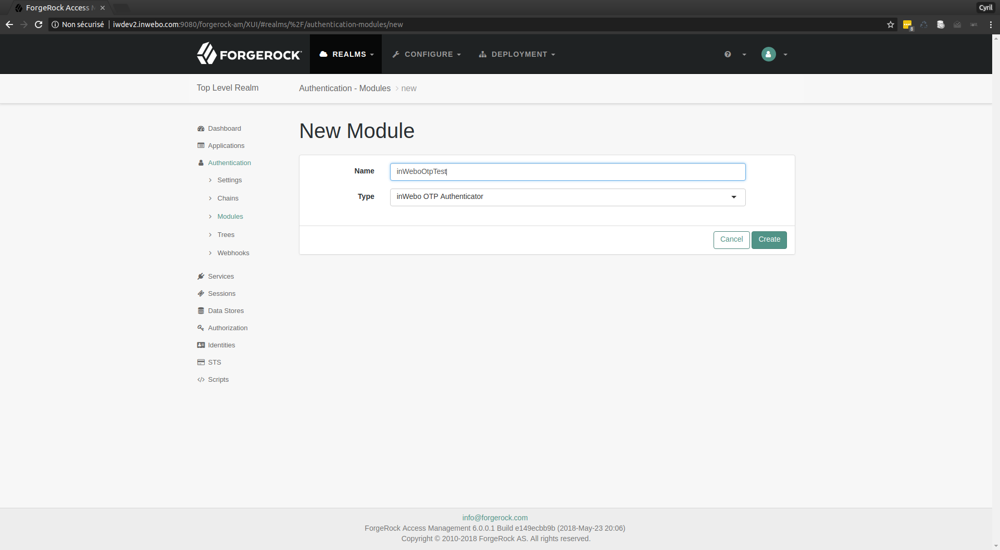
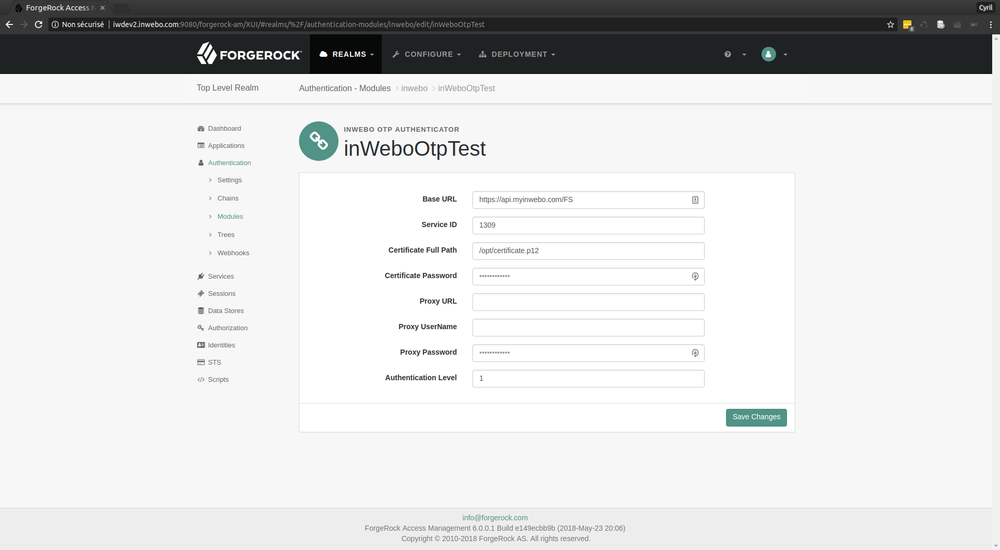
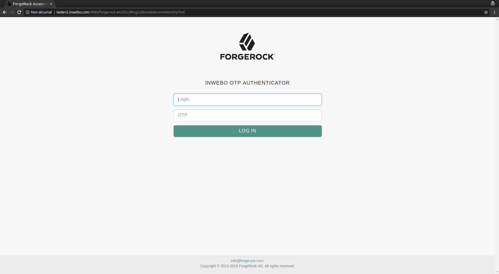

 inWebo ForgeRock AM Custom Authentication Module
 =======================================================
 
 Requirements
 ------------
 
 1. [ForgeRock AM 5.5.1 or 6.0.0](https://www.forgerock.com/platform/access-management)
 1. [Tomcat 8](http://apache.mediamirrors.org/tomcat/tomcat-8/v8.5.30/bin/apache-tomcat-8.5.30.tar.gz)
 1. [OpenJDK 1.8](http://openjdk.java.net/)
 
 Building from Source
 --------------------
 
 ```bash
 $ git clone https://github.com/inwebo-tech/plugin-forgerock-am.git
 $ cd plugin-forgerock-am 
 $ ./mvnw clean package
 ```
 
 inWebo service configuration:
 -----------------------------
 
 1. Log in to the inWebo administration console.
 1. Navigate to the appropriate service view.
 1. Go to `Secure Sites` and click on the `Download a new certificate for the API` button.
 1. Remember to set the Certificate `Authentication` option to `Yes`.
 
 1. Synchronize your forgerock-am login with inWebo login.
 
 [Installation inWebo Otp Authenticator Plugin](iw-forgerock-am-otp)
 -------------------------------------------------------------------

1. Copy resource:
    ```bash
    $ sudo unzip iw-forgerock-am-otp-*.zip -d /tmp/forgerock-am-opt
    $ sudo cp /tmp/forgerock-am-opt/edit-webapp/WEB-INF/lib/iw-forgerock-am-otp-*.jar /path/to/tomcat/webapps/openam/WEB-INF/lib/
    $ sudo cp /tmp/forgerock-am-opt/edit-webapp/WEB-INF/lib/idp-connector-auth-repackage-0.3.0.jar /path/to/tomcat/webapps/openam/WEB-INF/lib/   
    ```
1. restart tomcat.

#### Configuration:

1. Go to Admin Console and log in as `amadmin`.
2. Navigate to {REALM}->Authentification->Modules.
3. Add new module with `inWebo OTP Authenticator` Type.


4. To test config go to `http(s)://{OPENAM_HOST}/openam/XUI/#login/&module=inWeboOtpTest`

